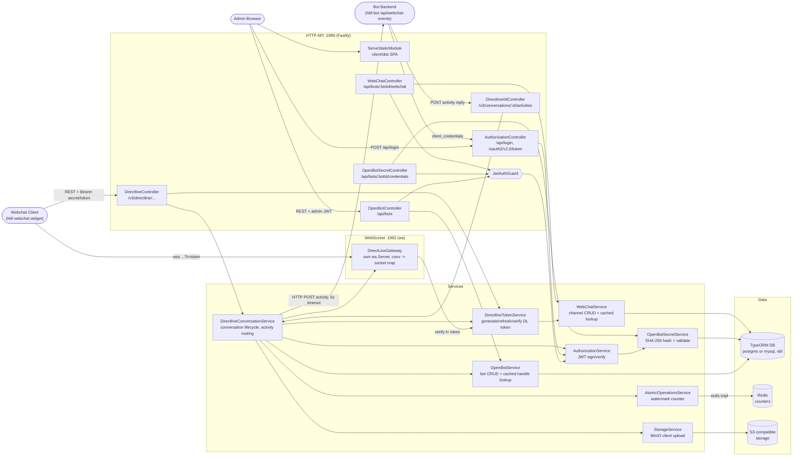
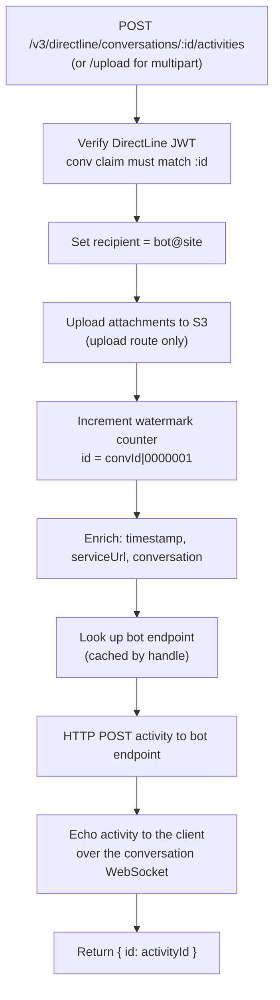
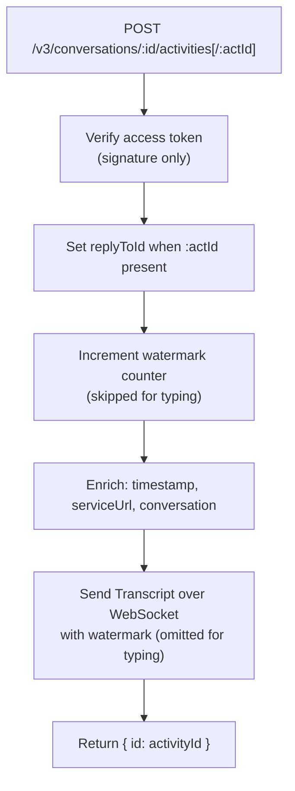

# Architecture: open-bot-framework

## Component Diagram

## Flow: User Sends Message

## Flow: Bot Replies

## Notes

- Two listeners: Fastify HTTP on `PORT` (1986) and a separate raw `ws` server on `SOCKET_PORT` (1992). The gateway is a plain `@Injectable()` that creates its own `ws.Server`, so Nest's WebSocket adapter is not involved.
- The same HTTP port serves the React admin SPA from `client/dist` via `ServeStaticModule` with `fallthrough: true` (required for Fastify's static loader to serve the SPA index for client-side routes).
- The DB driver comes from `TYPEORM_CONNECTION`: `postgres` in `.env` and `docker-compose.yml`, `mysql` in HBF local dev. `synchronize: true` is always on, so the schema auto-syncs at startup and the `migrations/` directory does not exist yet.
- Nothing is persisted per conversation or per activity. Conversations live only in the JWT (`conv` claim) plus the counter key; activity history is not stored, so `watermark`-based replay is not supported.
- WebSocket auth: the gateway parses `?t=<DirectLine token>`, verifies it ignoring expiry, and requires the path to be `/v3/directline/conversations/<conv>/stream` with `conv` matching the token claim. Sockets are held in a plain `Map`, one per conversation, and are never removed on close, so this is single-instance only.
- `sendToConversation` retries three times with 1s/2s/3s sleeps if the socket is not registered yet, then logs a warning and drops the transcript.
- Atomicity backend is chosen once at boot from `ATOMIC_OPERATIONS_IMPLEMENTATION`; Redis keys carry a 1h TTL, and a failed Redis connect silently falls back to the in-memory manager (documented as emergency-only).
- Activity ids follow the DirectLine convention `<conversationId>|<7-digit counter>`; `typing` activities get a random suffix instead and neither increment nor carry a watermark.
- Bot client secrets are SHA-256 hashed (`AuthorizationUtils.createHash`), not bcrypt. Only the admin password uses bcrypt. `plainReducted` keeps the first 3 characters for display.
- All three token types (admin, client-credentials, DirectLine) are signed with the same `JWT_SECRET`, and `verifyAccessToken` checks only the signature, so the bot-reply endpoints accept any token this service issued.
- `StorageService` builds its MinIO client in the constructor and throws when `STORAGE_ENDPOINT` or `STORAGE_BUCKET` is missing, which aborts application boot.
