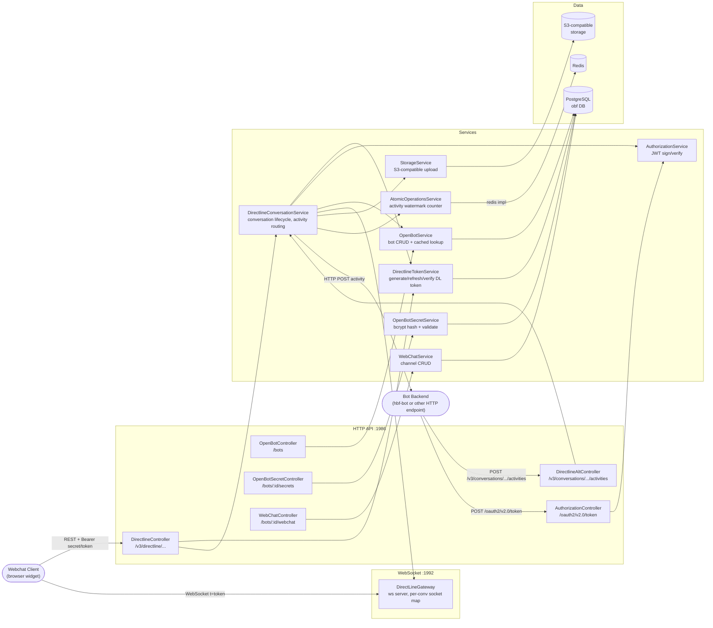
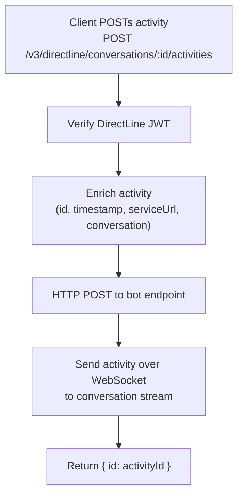
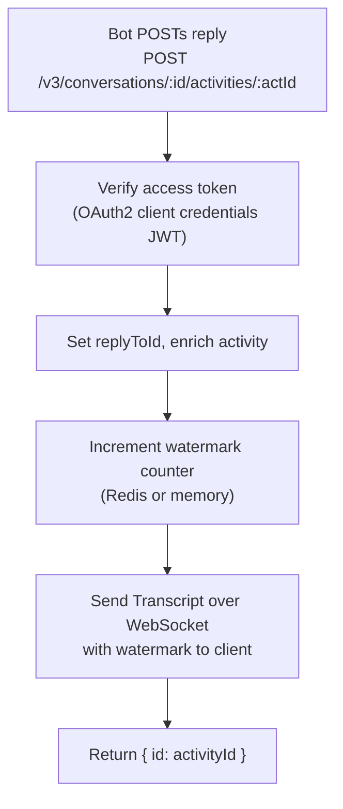

# Architecture: open-bot-framework

## Component Diagram

## Flow: User Sends Message

## Flow: Bot Replies

## Notes

- Two ports: HTTP (1986) for REST, separate WebSocket server (1992) for streaming.
- `synchronize: true` in TypeORM config — schema auto-syncs on startup (dev-safe, disable in prod).
- Atomicity backend selected at startup from `ATOMIC_OPERATIONS_IMPLEMENTATION` env: `redis` (requires Redis) or `memory` (single-instance only).
- Bot secrets are bcrypt-hashed. `plainReducted` stores a redacted plain version for display.
- Activity IDs follow DirectLine convention: `<conversationId>|<7-digit-zero-padded-counter>`.
- `typing` activities get random IDs and do not increment the watermark counter.
