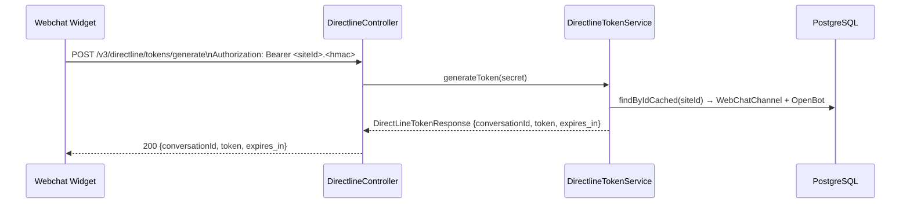
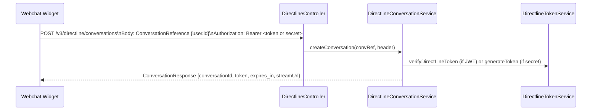
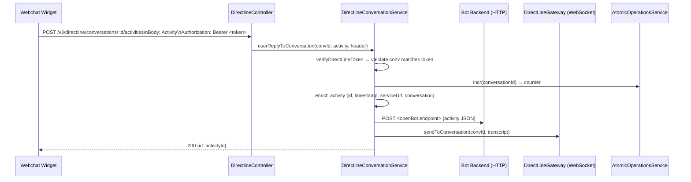
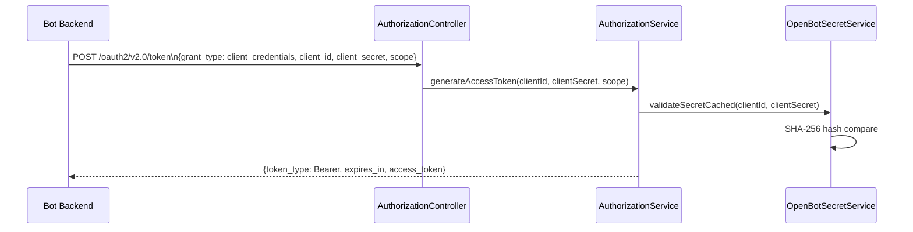
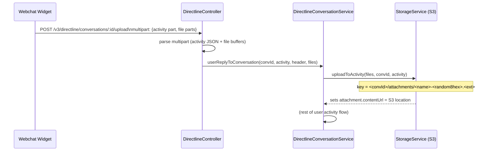

# open-bot-framework: Service Architecture

> Reference document for the open-bot-framework DirectLine 3.0 gateway.
> Source: src/ (NestJS service).
> Last updated: 2026-03-13

## What This Service Is

`open-bot-framework` is **not** a bot workflow node engine. It is a self-hosted
**DirectLine 3.0 gateway** that bridges webchat clients (browser widget) to any
HTTP-accessible bot backend (e.g. hbf-bot). There are no `ComponentBase`
subclasses, no node type registry, and no `ComponentTree` workflow.

The correct place to look for bot workflow node types is `packages/hbf-bot`.

---

## Service Entry Points

| Port (default) | Env var | Purpose |
|---|---|---|
| 1986 | `PORT` | HTTP REST API (NestJS + Fastify) |
| 1992 | `SOCKET_PORT` | Raw WebSocket server (ws library) |

---

## Data Models

### OpenBot
Represents a registered bot backend.

| Field | Type | Notes |
|---|---|---|
| `id` | uuid (PK) | Auto-generated |
| `handle` | string (unique) | URL-safe identifier, regex `^[a-zA-Z][a-zA-Z0-9-]{2,62}[a-zA-Z0-9]$` |
| `endpoint` | string | HTTP URL the gateway POSTs activities to |
| `schemaVersion` | string | Hardcoded `V1.3` on create |
| `createdAt` | timestamptz | |
| `updatedAt` | timestamptz | |

### OpenBotSecret
API credential for a bot to authenticate against the gateway (OAuth2 client credentials).

| Field | Type | Notes |
|---|---|---|
| `id` | uuid (PK) | Used as `client_id` |
| `openBot` | FK → OpenBot | Cascade delete |
| `description` | string | Human label |
| `secretHash` | string | SHA-256 of the plain secret |
| `plainReducted` | string | First 3 chars of plain secret (display only) |
| `expiresAt` | timestamptz (nullable) | Optional expiry |

### WebChatChannel
A webchat site linked to a bot. Holds two rotating secrets for client auth.

| Field | Type | Notes |
|---|---|---|
| `id` | string (PK) | 11-char random alphanumeric, generated on create |
| `openBot` | FK → OpenBot | Cascade delete |
| `name` | string | Human label |
| `secret1` | string (indexed) | Format: `<siteId>.<base64url-32-bytes>` |
| `secret2` | string (indexed) | Same format, independent rotation |
| `createdAt` | timestamptz | |

---

## Token Types

Two distinct JWT types flow through the system.

### DirectLine Token (client-facing)
Issued to the webchat widget. Signed with `JWT_SECRET`.

Payload fields:
- `bot` — bot handle
- `site` — webchat channel id
- `conv` — conversation id (format: `<base64url-12>-<DIRECTLINE_REGION>`)
- `user` — user id (optional, set on generate or createConversation)
- `iss`, `aud` — `https://<DIRECTLINE_HOST>/`
- `nbf`, `exp` — validity window (`JWT_EXPIRATION_SECONDS`, default 3600)

### Access Token (server-facing)
Issued to the bot backend via OAuth2 client credentials. Signed with `JWT_SECRET`.

Payload fields:
- `aud` — scope (default `https://api.botframework.com/.default`)
- `iss` — `DIRECTLINE_HOST`
- `sub` — `client_id` (OpenBotSecret id)

---

## Activity ID Convention

Activity IDs follow the DirectLine pattern:

```
<conversationId>|<7-digit-zero-padded-counter>
```

Example: `abc123-eu|0000003`

`typing` activities get a random 11-char suffix and do **not** increment the
watermark counter. All other activity types increment the per-conversation
atomic counter (Redis or memory).

---

## Request Flows

### Flow 1: Token Generation (webchat widget)



### Flow 2: Create Conversation



`streamUrl` format: `<DIRECTLINE_SOCKET_URL>/v3/directline/conversations/<convId>/stream?watermark=-&t=<token>`

### Flow 3: User Sends Activity



### Flow 4: Bot Replies

```mermaid
sequenceDiagram
    participant Bot as Bot Backend
    participant Alt as DirectlineAltController
    participant CS as DirectlineConversationService
    participant Auth as AuthorizationService
    participant Atomic as AtomicOperationsService
    participant GW as DirectLineGateway (WebSocket)

    Bot->>Alt: POST /v3/conversations/:convId/activities/:actId\nAuthorization: Bearer <access_token>
    Alt->>CS: replyToActivity(convId, activity, header, actId)
    CS->>Auth: verifyAccessToken(token)
    CS->>CS: set activity.replyToId = actId
    CS->>Atomic: incr(conversationId) → watermark
    CS->>CS: enrich activity (id, timestamp, serviceUrl, conversation)
    CS->>GW: sendToConversation(convId, {activities, watermark})
    CS-->>Bot: 200 {id: activityId}
```

### Flow 5: Bot Authenticates (OAuth2 Client Credentials)



### Flow 6: File Upload



---

## WebSocket Lifecycle

The WebSocket server (`DirectLineGateway`) runs on `SOCKET_PORT` (default 1992)
independently from the HTTP server. It maintains a `Map<conversationId, WebSocket>`.

**Connection handshake:**
1. Client connects to `wss://<host>/v3/directline/conversations/<convId>/stream?watermark=<w>&t=<token>`
2. Gateway verifies the DirectLine JWT (`t` param).
3. Validates URL `convId` matches `token.conv`.
4. Registers socket in `socketMeta` map under `convId`.

**Sending:**
- `sendToConversation(convId, transcript)` looks up the socket and calls `ws.send(JSON.stringify(transcript))`.
- Retries up to 3 times with exponential backoff (1s, 2s, 3s) if the socket is not yet registered.
- Bot replies include a `watermark` field on the transcript. User-originated activities do not.

---

## Atomicity (Watermark Counter)

Activity counter keyed by `conversationId`. Selected at startup via `ATOMIC_OPERATIONS_IMPLEMENTATION`.

| Backend | Class | Notes |
|---|---|---|
| `redis` (default) | `RedisAtomicOperationsManager` | Uses `REDIS_URI`. Keys expire after 1 hour. `incr` returns new value minus 1. |
| `memory` (fallback) | `MemoryAtomicOperationsManager` | Single-process only. Falls back automatically if Redis is unreachable. |

---

## Environment Variables

| Variable | Default | Purpose |
|---|---|---|
| `PORT` | 1986 | HTTP server port |
| `SOCKET_PORT` | 1992 | WebSocket server port |
| `JWT_SECRET` | (required) | Signs both token types |
| `JWT_EXPIRATION_SECONDS` | 3600 | Token lifetime in seconds |
| `DIRECTLINE_HOST` | (required) | Used in token `iss`/`aud` and `serviceUrl` |
| `DIRECTLINE_SOCKET_URL` | (required) | Base URL for `streamUrl` construction |
| `DIRECTLINE_REGION` | (optional) | Appended to conversation ids: `<id>-<region>` |
| `REDIS_URI` | (optional) | ioredis connection string |
| `ATOMIC_OPERATIONS_IMPLEMENTATION` | `redis` | `redis` or `memory` |
| `STORAGE_BUCKET` | (required for uploads) | S3 bucket name |
| `STORAGE_ENDPOINT` | (optional) | S3-compatible endpoint (MinIO etc.) |
| `STORAGE_ACCESS_KEY` | (required for uploads) | S3 access key |
| `STORAGE_SECRET_KEY` | (required for uploads) | S3 secret key |
| `STORAGE_REGION_S3` | (required for uploads) | S3 region |
| `STORAGE_FORCE_S3_PATH_STYLE` | false | Enable for MinIO path-style |
| `DB_*` / TypeORM env | (required) | PostgreSQL connection |

---

## Caching

In-memory cache (NestJS `CacheModule`) with a 10-second TTL is used for:
- `OpenBot` by handle (`findByHandleCached`)
- `OpenBotSecret` by id (`findByIdCached`, `validateSecretCached`)
- `WebChatChannel` by id (`findByIdCached`, `existsByIdCached`)

Cache key for WebChatChannel with relations: `webchat:<id>:<relation1>,<relation2>`

---

## Notes

- `synchronize: true` in TypeORM — schema auto-syncs on startup. Disable in production.
- `typing` activities never increment the watermark counter and receive a random id.
- The bot `handle` must match regex `^[a-zA-Z][a-zA-Z0-9-]{2,62}[a-zA-Z0-9]$`.
- Bot secrets are SHA-256 hashed (not bcrypt). `plainReducted` stores only the first 3 characters.
- WebChatChannel secrets rotate independently: setting `secret1` or `secret2` to `null` in a PATCH regenerates that secret only.
- `createConversation` accepts either a DirectLine JWT (2 dots) or a site secret (1 dot) — distinguished by dot count in the bearer value.
